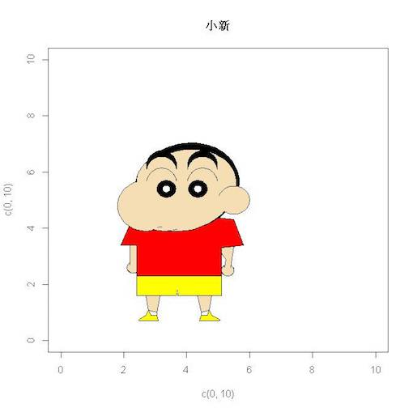

```{r ,echo=FALSE,warning=FALSE,message=F}
options('scipen'=100,'digits'=2)
knitr::opts_chunk$set(comment="",prompt=F,strip.white=F,
                      warning=FALSE,message=F,echo=T,
                      fig.align='center',fig.height=3.5)
library(dplyr)
library(dygraphs)
library(ggplot2)
library(data.table)
library(devtools)
library(plotly)
library(xtable)
library(rCharts)
library(tidyr)
library(DT)
library(RColorBrewer)
library(dplyr)
```

# Speaker

## Alger, Yang
<div style='float:left;width:48%;'>
__苟且的役男, Junior Data Analyst__

<p>
  * Master of Statistics in NCCU 
  * RA in NCCU
  * Taiwan Healthcare Database Data Analysis Lab
  * Data Analyst Intern in DSP 
  * R Course Assistant in TDSF 
  * Champion of 2016 Aisa Open Data Hackathon

#### __Skills__
<p>
  * R, SQL, PYTHON, MLDM,...

</div>

<div style='float:left;width:48%;'>

</img>
</div>

# 課程綱要

## Agenda 

<div style='float:left;width:48%;'>

- Data Visualization
- `ggplot2` in R
    * 基本架構介紹
    * 起手式(基本語法)
    * 應用(各種圖形的呈現)
        + `Bar`
        + `Line`
        + `Histogram`
        + `Boxplot`
        + `point`
    * 進階技巧

  
</div>

<div style='float:left;width:48%;'>

- 互動式視覺化呈現
- Bonus

</img>

</div>

## Data Visualization

- 清晰有效地傳達與溝通訊息
- 教學、研究、宣傳
- 美學、功能兼顧
- 統計圖形、訊息可視化
- 一張好圖，勝過千言萬語

## ggplot2簡介

<div style='float:left;width:50%;'>
- 套件下載次數第一名([Source](https://www.rdocumentation.org/trends?page1=1&sort1=direct&page2=1&sort2=total&page3=1&page4=1))
- R環境下的繪圖套件
- 取自 “The Grammar of Graphics” (Leland Wilkinson, 2005)
- [設計理念](https://github.com/cosname/ggplot2-translation/blob/master/preface.md)
    - 採用圖層系統
    - 用抽象的概念來控制圖形，</br>
      避免細節繁瑣
    - 圖形美觀
</div>   

<div style='float:right;width:48%;'>
</img>
</div> 

## The Anatomy of a Plot 

<center>
</img>
</center>

## ggplot2基本架構

- 資料 (data) 和映射 (mapping)
- 幾何對象 (`geom`etric)
- 座標尺度 (`scale`)
- 統計轉換 (`stat`istics)
- 座標系統 (`coord`inante)
- 圖層 (layer)
- 刻面 (`facet`)
- 主題 (`theme`)

## ggplot2基本架構(2)

<center>
</img>
</br>
source: http://goo.gl/Odt2Rs
</center>

## ggplot2 基本語法 

```{r echo=TRUE, eval=FALSE}
ggplot(data=..., aes(x=..., y=...)) + 
  geom_xxx(...) +
  stat_xxx(...) + 
  facet_xxx(...) + ...
```

- `ggplot` 描述 data 從哪來
- `aes` 描述圖上的元素跟 data 之類的對應關係
- `geom_xxx` 描述要畫圖的類型及相關調整的參數
- 常用的類型諸如：`geom_bar`, `geom_line`, `geom_points`, ...

# 圖層概念的實作

## Various functions

```{r}
library(ggplot2)
# list all geom
ls(pattern = '^geom_', env = as.environment('package:ggplot2'))
```

## **注意**

- 使用 `data.frame` 儲存資料 (不可以丟 matrix 物件)
- 使用 `long format` (利用reshape2將資料轉換成 1 row = 1 observation)

</br>

<center></center>


## 馬上來個範例 {data-background="a.jpeg"}

```{r echo=TRUE,fig.width=6,fig.height=3,fig.align='center'}
# 先定義一個資料表
data <- data.frame(身份 = c("大學部","研究所","教授","講師","助教"), 
                   人數 = c(20,15,5,2,3))
# plot
ggplot(data = data, aes(x = 身份, y = 人數)) + 
  geom_bar(stat = "identity") +
  theme_grey(base_family = "STHeiti") 
```

# 正片開始

## 首先請先安裝以下套件

- 安裝套件
```{r echo=TRUE, eval=FALSE}
install.packages(c("ggplot2","dplyr","reshape2"),repos="http://cran.csie.ntu.edu.tw/")
```

</br>

- 載入套件
```{r echo=TRUE, eval=FALSE}
library(ggplot2)
library(dplyr)
library(reshape2)
```

</br>

**注意**：下載完套件一定要記得 `library` 才能使用喲！

## 一切從讀檔開始（CSV）

- [課程資料下載](https://ling32342.github.io/2017_NCCU_R/data/transaction.csv)

```{r,eval=FALSE}
############### 絕對路徑 ###############
# 請輸入完整的檔案路徑
data <- read.csv("/Volumes/SD-Lofu/PIXNET_DS_Workshop_EDA_Alger/data/transaction.csv") #如果你是mac
data <- read.csv("C:\\Users\\transaction.csv") #如果你是windows

############### 相對路徑 ###############
# 瞭解現在我們所處在的路徑
getwd()
# 設定我們檔案存放的路徑
setwd() 
# 讀檔起手式
data <- read.csv("transaction.csv") 
# 若讀入的是亂碼，試試以下
data <- read.csv("transaction.csv",fileEncoding = 'big5')  #如果你是mac
data <- read.csv("transaction.csv",fileEncoding = 'utf-8') #如果你是windows
```

```{r,echo=FALSE}
data <- read.csv("data/transaction.csv") %>% as.data.frame()
data <- data[,-1]
data$trac_month <- factor(data$trac_month)
```

## 資料介紹
```{r, echo=FALSE}
head(data[,sample(1:15,6)],5) %>% 
  knitr::kable()
```

## 欄位說明

```{r echo = FALSE,fig.height=3, warning=FALSE, fig.align='center', message=FALSE, results='asis'}
data.frame(英文欄位名稱=c("city","district","trac_year","trac_month","trac_type","trac_content",
                   "use_type","build_type","build_ymd","area_land","area_build",
                   "area_park","price_total","price_unit"),
           中文欄位名稱=c("縣市","鄉鎮市區","交易年份","交易月份","交易標的","交易筆棟數","使用分區或編定",
                    "建物型態","建築完成年月","土地移轉總面積.平方公尺.","建物移轉總面積.平方公尺.",
                    "車位移轉總面積.平方公尺.","總價.元.","單價.元.平方公尺.")) -> name

```

<div style='float:left;width:48%;'>
```{r, echo = FALSE}
name[1:7,] %>% knitr::kable()
```

</div>

<div style='float:right;width:50%;'>
```{r, echo = FALSE}
name[8:14,] -> name2
rownames(name2) <- c(1:7)
name2 %>% knitr::kable()
```

</div>


## 以為開始了嗎？

- 進行分析前，先去了解資料的型態與特性

```{r echo=TRUE}
str(data)
```

## 身為資料分析師，一定要有的好習慣！

- 暸解基本的各變數統計量值

```{r echo=TRUE}
summary(data) 
```


# Bar chart

## `geom_bar`

- 先來看看2013年在各縣市的案件交易量

```{r,warning=FALSE,fig.height=3,fig.align='center', message=FALSE}
thm <- function() theme(text=element_text(size = 15, family = "STHeiti")) # 控制字體與大小
    # STHeiti是只有Mac才有的字體, 用來解決Mac系統中文顯示錯誤的問題
    # Windows系統使用者請忽略 `+ thm()` 指令
ggplot(data,aes(x=city)) + geom_bar(stat = "count") + thm() # stat = "count" 算個數
```

## Change labels!

```{r,warning=FALSE,fig.height=3.5,fig.align='center', message=FALSE}
ggplot(data,aes(x=city)) + geom_bar(stat = "count") + thm() +
  labs(title="各縣市交易量",x="縣市",y="交易量") # lab用來幫圖形的標題、x軸與y軸做命名
```

## Change colors!

- 顏色調整：`color` vs `fill`?
```{r,warning=FALSE,fig.height=3.5,fig.align='center', message=FALSE}
ggplot(data,aes(x=city)) + geom_bar(stat = "count") + thm() +
  labs(title="各縣市交易量",x="縣市",y="交易量") +
  geom_bar(fill='snow', color='black') # see colors() if you're picky
```


## Bar chart

-  看臺北市各行政區的案件交易量
```{r,warning=FALSE,fig.height=3.5,fig.align='center', message=FALSE}
# 資料整理
temp = filter(data,city == "臺北市") 
temp = group_by(temp,district) 
table = summarise(temp, amount=n())  # dplyr::n 用來計數
head(table,5)
```

## Bar chart

```{r,warning=FALSE,fig.align='center', message=FALSE}
ggplot(table,aes(x=district,y=amount)) +
  geom_bar(stat = "identity") + thm() # stat='identity'以表格的值做為bar的高度
```


## Reoder x
```{r ,warning=FALSE,fig.align='center', message=FALSE}
ggplot(table,aes(x=reorder(district,-amount), y=amount)) +
  geom_bar(stat='identity') + thm() + 
  labs(titles = "臺北市各行政區交易量", x = "行政區", y = "案件數")
```

## 小挑戰

- 計算臺北市&高雄市的各使用分區或編定(`use_type`)所佔比例

```{r,echo=FALSE}
temp = filter(data,city == "臺北市" | city == "高雄市" ) 
temp = group_by(temp,city,use_type) 
temp = summarise(temp,amount = n()) 
temp = mutate(temp,rate = round(amount/sum(amount),3) ) -> table
table
```

## 參考解答

```{r, eval=FALSE}
temp = filter(data,city == "臺北市" | city == "高雄市" ) # 挑出台北市或高雄市
temp = group_by(temp,city,use_type) # 根據city與use_type分群
temp = summarise(temp,amount = n()) # 計算個群的數量
temp = mutate(temp,rate = round(amount/sum(amount),3) ) -> table # 新增比例欄位
```

<center>
</img>
</center>

## Grouping：`stack`
```{r,warning=FALSE,fig.align='center', message=FALSE,fig.height=4}
ggplot(table,aes(x = city, y = rate, fill = use_type)) +
  geom_bar(stat = 'identity', position = 'stack') + thm() # stack類別堆疊
```

## Grouping：`dodge`
```{r,warning=FALSE,fig.align='center', message=FALSE,fig.height=4}
ggplot(table,aes(x = city, y = rate, fill = use_type)) +
  geom_bar(stat = 'identity', position = 'dodge')  + # dodge類別並排
  thm() + scale_fill_discrete(name  ="使用分區或編定")  # 設定圖例的顯示
```

# Line chart

## `geom_line`

- 各月份交易量

```{r,warning=FALSE,fig.align='center', message=FALSE}
temp = group_by(data,trac_month)  
table = summarise(temp,amount=n()) 
table
```

## Line chart

```{r,warning=FALSE,fig.align='center', message=FALSE}
ggplot(table,aes(x=trac_month,y=amount,group=1)) +
  geom_line() + thm() + labs(x = "交易月份" , y = "交易數量")
```


## `Multiple` Line

- 各縣市各月份交易量比較

```{r,warning=FALSE,fig.align='center', message=FALSE}
temp = group_by(data,city,trac_month)  
table = summarise(temp,amount=n()) 
table
```

## `Multiple` Line

```{r,warning=FALSE,fig.align='center', message=FALSE}
ggplot(table,aes(x=trac_month,y=amount,group=city,color=city)) +
  geom_line() + geom_point() + thm() + 
  labs(x = "交易月份" , y = "交易數量")
```


## 小挑戰

- 計算臺北市&高雄市不同屋齡的交易量，並畫出 `Multiple` Line plot

```{r,echo=FALSE}
temp = filter(data,city == "臺北市" | city == "高雄市" )
temp = group_by(temp,city,age)
table = summarise(temp,amount = n()) 
#head(table[c(1:3,13:15),],8) 
ggplot(table,aes(x=age,y=amount,group=city,color=city)) +
  geom_line() + geom_point() + thm()
```

## 參考答案(有發現什麼問題嗎？！)

```{r}
temp = filter(data,city == "臺北市" | city == "高雄市" )
temp = group_by(temp,city,age)
table = summarise(temp,amount = n()) 
ggplot(table,aes(x=age,y=amount,group=city,color=city)) +
  geom_line() + geom_point() + thm()
```

# Histogram

## Histogram

- `geom_histogram`
```{r,warning=FALSE,fig.align='center', message=FALSE}
ggplot(data,aes(x=age, y =..count..)) + 
  geom_histogram()
```


## Histogram

- `aes(y=..count..)` vs. `aes(y=..density..)`

```{r,warning=FALSE,fig.align='center', message=FALSE}
ggplot(data,aes(x=age, y =..density..)) + 
  geom_histogram()
```


